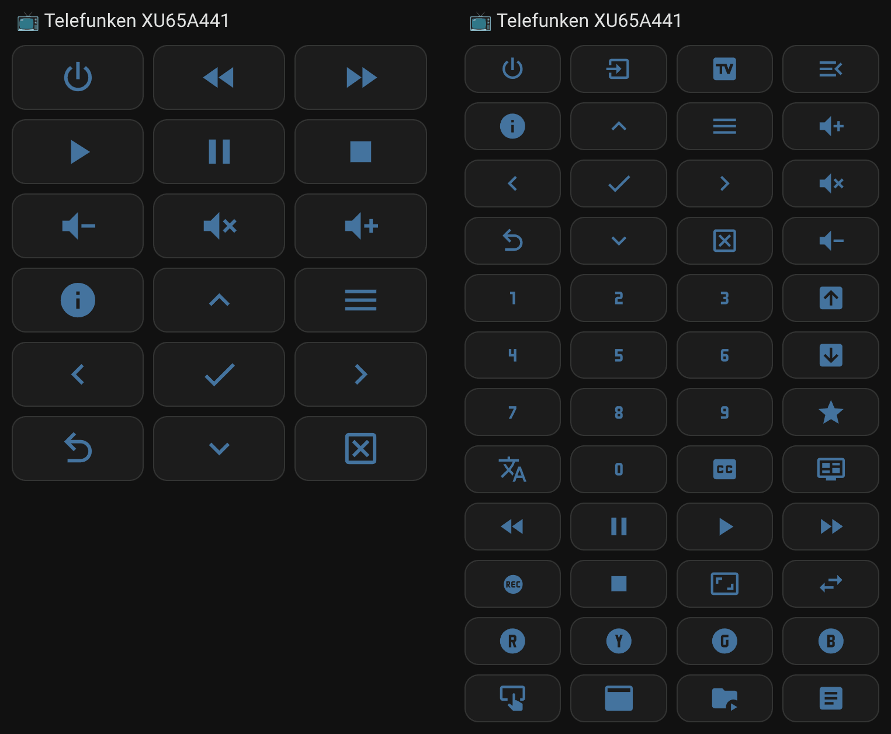

# Vestel VR Remote Integration for Home Assistant

This integration is named "Vestel VR Remote" after the API endpoint URL used for control (`/apps/vr/remote`), which stands for "Virtual Remote" in Vestel TVs.

A custom integration to control TVs using the Vestel VR Remote API. Vestel hardware and API are used by various brands, including Telefunken, JVC, Toshiba, RCA, and Hitachi, so this may work with similar models. Tested with Telefunken XU65A441.

## Features
- Configurable via UI: Enter IP and device name.
- Supports multiple TVs (different IPs).
- Button entities for keys like Power, Volume, Navigation, etc., with icons.
- Usable in dashboards, automations, and scripts.
- No external dependencies; uses aiohttp (built-in HA).

## Requirements
- Home Assistant 2025.8 or later.
- TV must be on the same network and API-enabled (port 56789).

## Installation
1. Download the `vestel_vr_remote` folder.
2. Place it in `config/custom_components/vestel_vr_remote`.
3. Restart Home Assistant.

(Alternatively, install via HACS as a custom repository: `https://github.com/neoge/vestel_vr_remote`.)

## Configuration
1. Go to **Settings > Devices & Services > Add Integration**.
2. Search for "Vestel VR Remote".
3. Enter the TV's IP address and a device name (e.g., "Living Room TV").
4. The integration tests the connection and adds the device with button entities.

## Usage
- Entities: e.g., `button.vestel_tv_power` – use in automations via `service: button.press`.
- For dashboards: Use built-in grid and button cards for a remote layout. See examples in the `examples/` folder. To customize, open the YAML file and search/replace the default device prefix (e.g., "vestel_tv") with your actual device name (lowercase with underscores, matching your config entry).

## Disclaimer
This project was largely created using AI assistance, but the code has been reviewed and tested by me.

License: MIT
